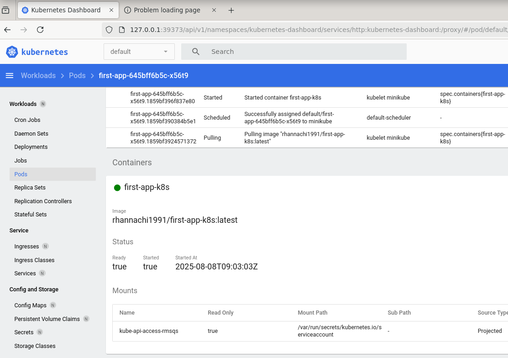
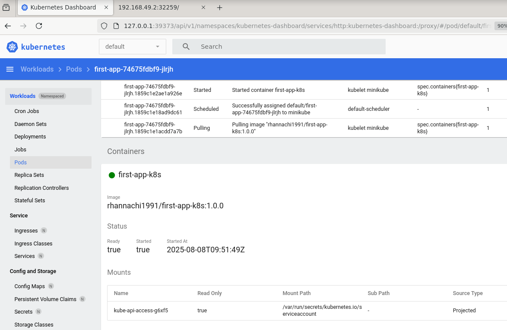
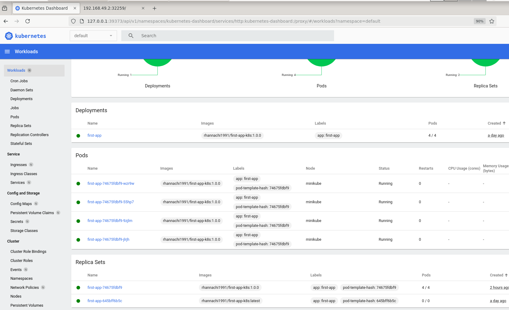
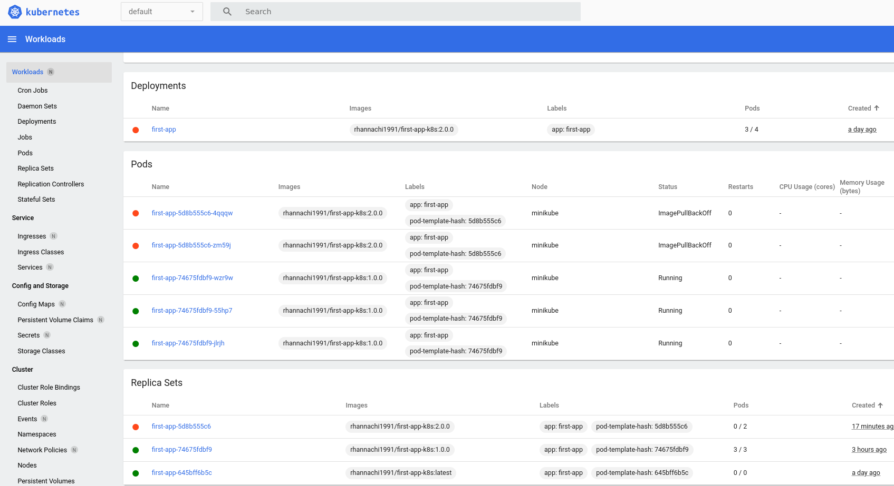
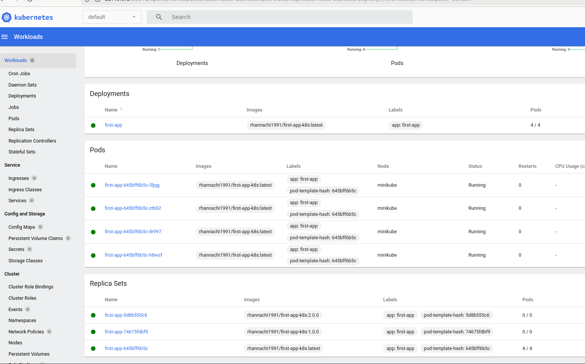

# Updating Deployments & Rollbacks

## Deployment

Dans notre code app.js, ajouter ces modifications `<h2>!!! Hola is new version !!!</h2>` :

```js 
app.get('/', (req, res) => {
    res.send(`
    <h1>Hello from this NodeJS app!</h1>
    <h2>!!! Hola is new version !!!</h2>
    <p>Try sending a request to /error and see what happens</p>
  `);
});
```

``` 
$ docker build -t rhannachi1991/first-app-k8s:1.0.0 .
$ docker login
$ docker push rhannachi1991/first-app-k8s:1.0.0
```

C'est important ici qu'à chaque modification apportée au code, il faut tagger l'image avec un tag spécifique pour que Kubernetes arrive à prendre en considération les nouveaux changements.

Après avoir publié sur DockerHub une nouvelle version de notre image, il faut que notre cluster la prenne en compte.

Il faut identifier le nom du conteneur dont on veut mettre l'image à jour.
Il suffit de consulter le Kubernetes dashboard puis le conteneur de notre Pod qui est en train de tourner.



On peut le faire aussi depuis la ligne de commande :

```
$ kubectl get deployment
NAME        READY   UP-TO-DATE   AVAILABLE   AGE
first-app   4/4     4            4           24h
```

Puis à partir du nom du deployment `first-app`, récupérer le nom du conteneur :

``` 
$ kubectl get deployment first-app -o jsonpath='{.spec.template.spec.containers[*].name}'
first-app-k8s
```

Donc il faut mettre à jour le conteneur `first-app-k8s` avec la nouvelle image `rhannachi1991/first-app-k8s:1.0.0`

``` 
$ kubectl set image deployment/first-app first-app-k8s=rhannachi1991/first-app-k8s:1.0.0
```

On peut suivre l'état de l'avancement du nouveau déploiement à travers cette commande :

```
$ kubectl rollout status deployment/first-app
Waiting for deployment "first-app" rollout to finish: 2 out of 4 new replicas have been updated...
Waiting for deployment "first-app" rollout to finish: 2 out of 4 new replicas have been updated...
Waiting for deployment "first-app" rollout to finish: 2 out of 4 new replicas have been updated...
Waiting for deployment "first-app" rollout to finish: 2 out of 4 new replicas have been updated...
Waiting for deployment "first-app" rollout to finish: 3 out of 4 new replicas have been updated...
Waiting for deployment "first-app" rollout to finish: 3 out of 4 new replicas have been updated...
Waiting for deployment "first-app" rollout to finish: 3 out of 4 new replicas have been updated...
Waiting for deployment "first-app" rollout to finish: 3 out of 4 new replicas have been updated...
Waiting for deployment "first-app" rollout to finish: 3 out of 4 new replicas have been updated...
Waiting for deployment "first-app" rollout to finish: 1 old replicas are pending termination...
Waiting for deployment "first-app" rollout to finish: 1 old replicas are pending termination...
Waiting for deployment "first-app" rollout to finish: 1 old replicas are pending termination...
Waiting for deployment "first-app" rollout to finish: 3 of 4 updated replicas are available...
deployment "first-app" successfully rolled out
```



Lorsque l’on déploie une nouvelle version d’une image **(via la mise à jour d’un Deployment)**, Kubernetes crée automatiquement un nouveau **ReplicaSet** associé à cette version.



---

Maintenant, nous allons tenter de déployer une nouvelle version de notre image Docker, la `2.0.0`, qui n'existe pas réellement sur DockerHub (afin de simuler une erreur) :
```
$ kubectl set image deployment/first-app first-app-k8s=rhannachi1991/first-app-k8s:2.0.0
```
On suit dans la console le processus de déploiement:
```
$ kubectl rollout status deployment/first-app
Waiting for deployment "first-app" rollout to finish: 2 out of 4 new replicas have been updated...
error: deployment "first-app" exceeded its progress deadline
```

Au départ, nous avions 4 pods en cours d'exécution, répartis entre différents ReplicaSets. Après le lancement du déploiement de la version `2.0.0` de l’image, Kubernetes essaie de créer de nouveaux pods avec cette image. Comme l’image `2.0.0` n’existe pas sur DockerHub, ces nouveaux pods passent en état `ImagePullBackOff`.\
Comme le montre le tableau des pods, il y a désormais 5 pods : certains pods sont en état d’erreur (`ImagePullBackOff`), tandis que les autres fonctionnent toujours avec l’ancienne version `1.0.0`.

Malgré cette erreur de déploiement, l’application web continue de fonctionner correctement grâce aux pods restants utilisant l’ancienne version de l’image (`1.0.0`). Kubernetes n’a donc pas interrompu le service existant, soulignant ici la robustesse du mécanisme de déploiement progressif et de rollback automatisé.



- Nouveau ReplicaSet créé pour l'image 2.0.0 
- Création du 5ème pod (maxSurge permet 1 pod supplémentaire)
- Le pod ne peut pas démarrer → ImagePullBackOff 
- Kubernetes continue d'essayer et peut créer un 2ème pod défaillant 
- Les anciens pods 1.0.0 restent en fonctionnement (haute disponibilité préservée)

## Rollbacks

Cette commande déclenche un **rollback automatique** vers la **révision précédente immédiatement disponible**. Kubernetes utilise son système de **révisions historiques** pour identifier et restaurer l'état antérieur fonctionnel.

```
$ kubectl rollout undo deployment/first-app
deployment.apps/first-app rolled back
```

Cette commande confirme que le **rolling update du rollback** s'est terminé avec succès.

```
$ kubectl rollout status deployment/first-app
deployment "first-app" successfully rolled out
```

### Rollback vers une révision spécifique

Pour **revenir à une version antérieure ciblée** et **plus spécifique**, on commence par afficher l'historique du déploiement.

```
$ kubectl rollout history deployment/first-app
deployment.apps/first-app 
REVISION  CHANGE-CAUSE
1         <none>
3         <none>
4         <none>
```

**Note importante :** On constate qu'il y a **3 révisions disponibles** (révisions 1, 3 et 4). La révision 2 est **manquante** - cela est **normal** car Kubernetes **supprime automatiquement** les révisions défaillantes ou remplacées pour maintenir l'historique propre.

### Inspection des révisions

On inspecte chaque révision pour savoir **quelle image Docker** a été déployée :

```
$ kubectl rollout history deployment/first-app --revision=1
=> Image:   rhannachi1991/first-app-k8s:latest

$ kubectl rollout history deployment/first-app --revision=3  
=> Image:   rhannachi1991/first-app-k8s:2.0.0

$ kubectl rollout history deployment/first-app --revision=4
=> Image:   rhannachi1991/first-app-k8s:1.0.0
```

**Analyse des révisions :**

- **Révision 1** : Version initiale avec le tag `latest`
- **Révision 3** : Tentative de déploiement vers `2.0.0` (défaillante)
- **Révision 4** : Rollback vers `1.0.0` (version fonctionnelle)


### Rollback ciblé vers une révision spécifique

Pour **restaurer le cluster** vers la **première version** déployée (révision 1) :

```
$ kubectl rollout undo deployment/first-app --to-revision=1
deployment.apps/first-app rolled back
```

**Mécanisme du rollback ciblé :**

- Cette commande **restaure exactement** la configuration de la révision 1
- Kubernetes **crée une nouvelle révision** (révision 5) qui **réplique** l'état de la révision 1
- Le processus utilise un **rolling update** pour garantir **zéro downtime**
- L'image `rhannachi1991/first-app-k8s:latest` sera **redéployée** sur tous les pods



Pour supprimer le service et le déploiement individuellement :
``` 
$ kubectl delete deployment first-app
deployment.apps "first-app" deleted

$ kubectl delete service first-app
service "first-app" deleted
```
ou
``` 
$ kubectl delete deployment,service first-app
```