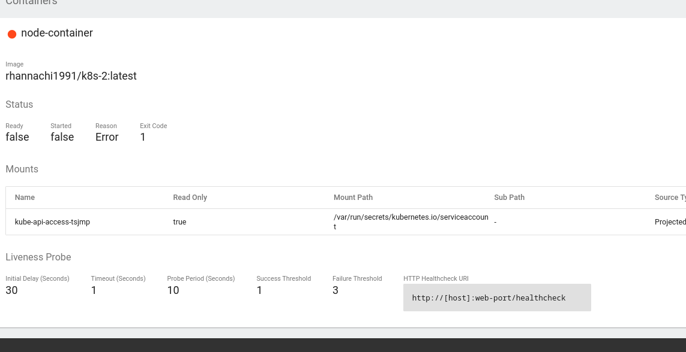

```
$ docker build -t rhannachi1991/k8s-2 .
$ docker login
$ docker push rhannachi1991/k8s-2:latest
```

```
$ kubectl apply -f=k8s.yaml
$ minikube service node-service
```

### livenessProbe - "Est-ce que l'application est vivante ?"
Rôle : Vérifie si le conteneur fonctionne correctement\
Action en cas d'échec : Redémarre le conteneur\
Question posée : "L'application est-elle dans un état fonctionnel ?"

**Note**: Même si notre container tourne sur le port 3000, on n'est pas obligé de l'indiquer dans la configuration `kind: Deployment` (mais il est fortement recommandé).

```
==> /error
```

