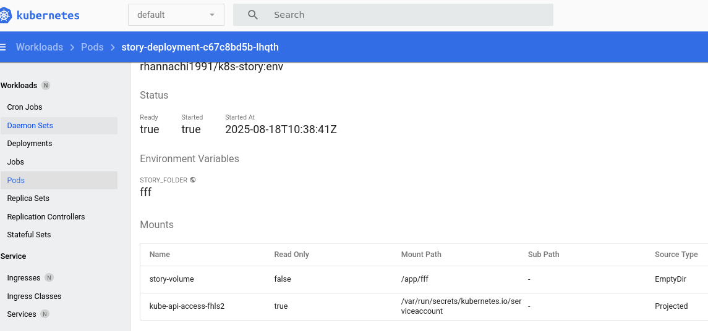

## Env
[k8s-env.yaml](k8s-env.yaml)

```
    k8s-env.yaml :
    
    volumeMounts:
        - mountPath: /app/fff # chemin à l'intérieur du conteneur où le volume sera monté
          name: story-volume    # nom du volume déclaré dans la section "volumes"
    env:
        # Déclare une variable d'environnement appelée STORY_FOLDER
        # Cette variable sera injectée dans le conteneur et accessible via "process.env?.STORY_FOLDER"
        - name: STORY_FOLDER
        # 'value' fixe ici la valeur de la variable à "fff"
        value: 'fff'
```

#### Note: 
-  il n’est pas possible de rendre `mountPath` dynamique directement via une variable d’environnement dans la définition du Pod ou du Deployment YAML.



### ConfigMaps
[k8s-env-2.yaml](k8s-env-2.yaml), [config-map.yaml](config-map.yaml)

On peut externaliser nos variables d’environnement dans un fichier `config-map.yaml` de type "ConfigMap", puis les réutiliser ensuite dans notre configuration de déploiement `k8s-env-2.yaml` en les injectant comme variables d’environnement dans le conteneur.

```
$ kubectl apply -f=k8s-env-2.yaml,config-map.yaml
deployment.apps/story-deployment created
service/story-service created
configmap/story-config-map created
```