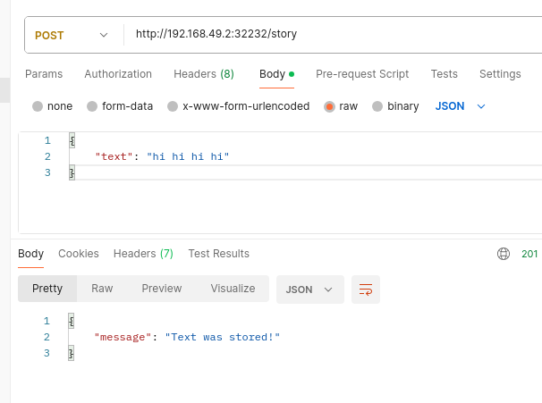
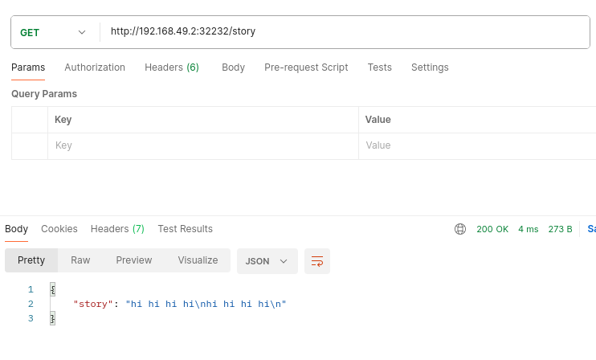

## Les volumes
Les volumes, tout comme les conteneurs, sont attachés aux Pods.
Les Pods sont **éphémères** dans un cluster Kubernetes : ils peuvent être supprimés ou remplacés pour diverses raisons (scaling, déploiement, panne, etc.).
Cela entraîne donc la suppression des volumes directement attachés aux Pods.

C’est pour cette raison que, dans Kubernetes, il existe [différents types de volumes](https://kubernetes.io/docs/concepts/storage/) permettant de répondre à des besoins variés.

Nous allons nous concentrer principalement sur **trois types de volumes** :
- **CSI**
- **emptyDir**
- **hostPath**

**Commençons par créer notre application**:
``` 
$ docker build -t rhannachi1991/k8s-story .
$ docker login
$ docker push rhannachi1991/k8s-story:latest
```
``` 
$ kubectl apply -f=k8s.yaml
$ minikube service story-service
```
### Sans volume

Avant d'ajouter un volume, faisons un petit test pour montrer qu’on perd les données enregistrées dans un **conteneur** si **celui-ci est arrêté**, par exemple suite à un crash.
- 1 - Ajouter une nouvelle story via la requête `POST /story`
- 2 - Vérifier que la story ajoutée est bien récupérée avec `GET /story`
- 3 - Simuler une erreur via l'endpoint `GET /error` pour forcer le crash ou le **redémarrage du conteneur**
- 4 - Re-vérifier les stories ajoutées précédemment avec `GET /story` ; on constatera que toutes les informations ont été perdues, car le conteneur a été recréé sans persistance des données.




Après avoir ajouté la section volumes dans la ressource `kind: Deployment`, on constate que même si le conteneur plante via l’endpoint `GET /error`, le Pod recrée un nouveau conteneur sans perte de données.
En effet, le volume appartient au Pod et non au conteneur : lorsque ce dernier est remplacé, le volume reste attaché et monté dans le nouveau conteneur, ce qui permet de conserver les informations.
