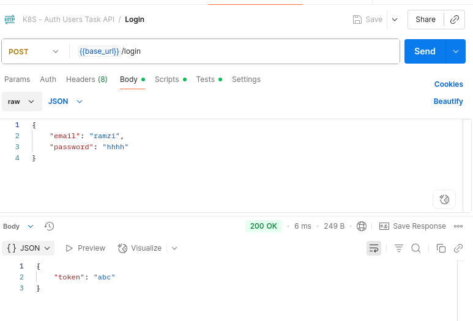

## Networking

```
+------------------------- Kubernetes Cluster -------------------------+
|                                                                      |
|  +-----------------------+    +-----------------------+              |
|  |         Pod 1         |    |         Pod 2         |              |
|  |                       |    |                       |              |
|  |  +-----------------+  |    |  +---------------+    |              |
|  |  | Auth API        |  |    |  | Tasks API     |    |              |
|  |  +-----------------+  |    |  +---------------+    |              |
|  |  +-----------------+  |    |                       |              |
|  |  | Users API       |  |    |                       |              |
|  |  +-----------------+  |    |                       |              |
|  +-----------------------+    +-----------------------+              |
|                                                                      |
+----------------------------------------------------------------------+
```

- Le cluster contient deux pods : Pod 1 et Pod 2.
- Pod 1 a deux containers : "Auth API" et "Users API".
- Pod 2 a un container : "Tasks API".
- L’utilisateur peut accéder de l’extérieur uniquement aux conteneurs «Tasks API» et «Users API». 
- La communication entre «Users API» et «Auth API» se fait en interne, sans accès externe.

[k8s-users.yaml](./k8s-users.yaml)

Dans la section `containers`, on a ajouté deux conteneurs dans le même Pod. Cela permet aux deux conteneurs de communiquer directement en interne, en utilisant l’adresse `localhost`, car ils partagent le même espace réseau et la même IP.
C’est pour cette raison que la variable d’environnement `AUTH_API_URL` dans l’application "Users API" prend la valeur `localhost` : elle pointe vers le service "Auth API" accessible sur la même IP Pod, via le port exposé par le conteneur "Auth API".

À noter:
- Dans Docker Compose, il est possible d’accéder à un autre conteneur via son nom (`auth:80`), car chaque conteneur a son propre réseau virtuel ou peut utiliser un bridge réseau.
- Dans Kubernetes, les conteneurs d’un même Pod **doivent** communiquer via l’adresse `localhost` (`http://localhost:80`), puisque le Pod possède une seule IP partagée pour tous ses conteneurs.
- Si les deux services étaient dans des Pods différents, il faudrait passer par un Service Kubernetes, et utiliser le nom DNS du Service pour communiquer entre Pods.

```
    k8s-users.yaml
    
    spec:
      containers:
        - name: users-container
          image: rhannachi1991/users-net-k8s:1.0.0
          env:
            - name: AUTH_API_URL
              value: 'localhost'
            ...
        - name: auth-container
          image: rhannachi1991/auth-net-k8s:latest
```
[postman-collection-api.json](./postman-collection-api.json)



