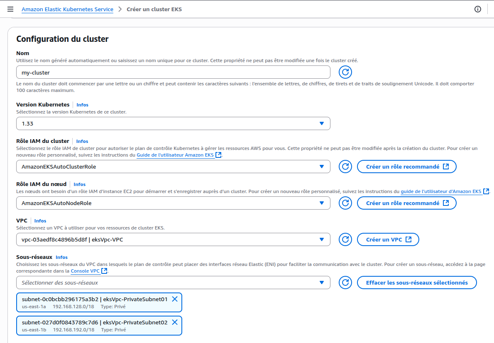
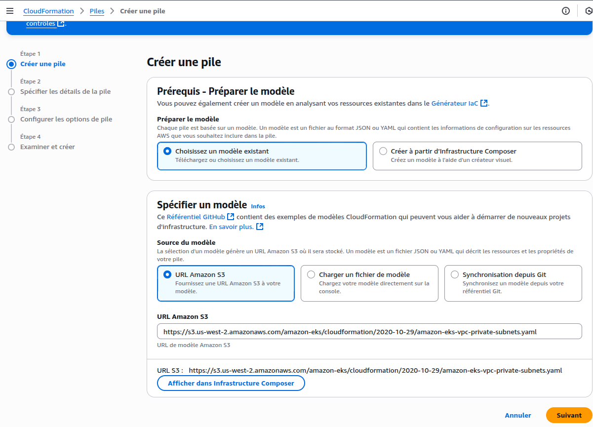
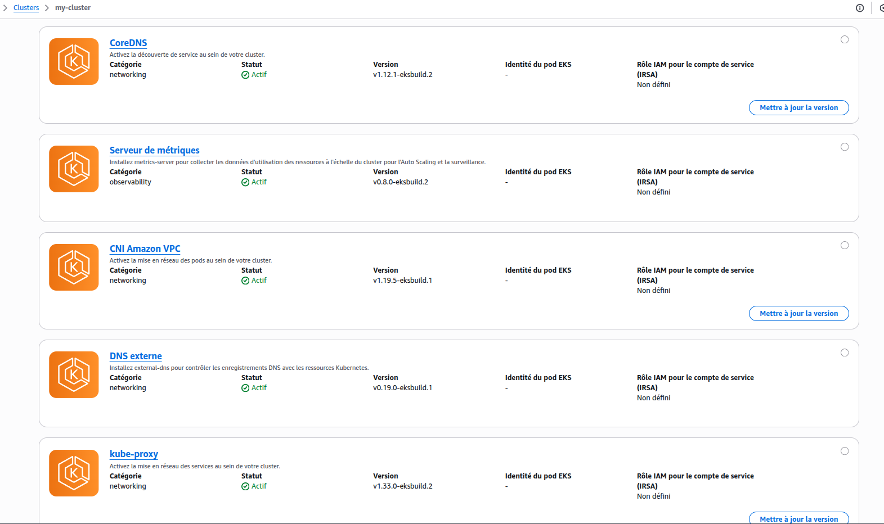

# EKS AWS

Comme déjà précisé, **Kubernetes** est un orchestrateur de conteneurs uniquement: pour fonctionner, il a besoin d’une infrastructure (machines, réseau, stockage, etc.) sur laquelle exécuter les pods et les services.

Dans notre environnement de test précédent avec **Minikube**, celui-ci a automatiquement préparé un cluster local, préconfiguré et prêt à l’emploi.  
En revanche, si nous voulons faire tourner Kubernetes sur un fournisseur cloud comme **AWS** (via EKS), il est nécessaire de configurer l’architecture adaptée (plan de contrôle, groupe de nœuds, réseau, etc.).

Nous aborderons plus en détail les différentes étapes de configuration (IAM, VPC, groupes de nœuds…) dans la suite du tutoriel.

## Créer un cluster EKS

La première étape consiste à configurer votre cluster comme suit:
- Indiquer le **nom du cluster** par exemple: `my-cluster`.
- Sélectionner le **rôle IAM du cluster** (s’il n’existe pas, vous pouvez le créer rapidement via «Créer un rôle recommandé»).
- Sélectionner le **rôle IAM du nœud** (idem, créez-le via «Créer un rôle recommandé» si nécessaire).
- Choisir un **VPC** pour héberger les ressources du cluster EKS. Dans ce tuto, nous allons créer le VPC `eksVpc` à l’aide d’un template CloudFormation.


### CloudFormation

AWS CloudFormation permet de créer des ressources à partir de modèles prédéfinis.
Pour créer une «pile» (stack), procédez ainsi:
- Dans CloudFormation, choisissez «Utiliser un modèle existant» pour l’étape de sélection du modèle.
- Spécifiez l’URL du modèle S3 Amazon:  
  [amazon-eks-vpc-private-subnets.yaml](https://s3.us-west-2.amazonaws.com/amazon-eks/cloudformation/2020-10-29/amazon-eks-vpc-private-subnets.yaml)
- Indiquez le nom de la pile, par exemple: `eksVpc`.
- Laissez les paramètres par défaut lors de la création, sauf exigences particulières.
- Une fois le VPC créé, retournez dans la configuration du cluster EKS, sélectionnez le VPC `eksVpc` créé et terminez la création du cluster en validant les paramètres par défaut.


### kubectl
comme on a vu précedament , kubectl nous permet de gérer notre cluster, précedament on a travailler sur un envirenoment local "minikube"! 
donc kubectl reagissez directement avec minikube pour appliquer les changements qu'on souhaite au cluster kubernetes.
maintenant il faut dire a kubectl qu'on est entrain d'utiliser un envirenement cloud aws avec une vrai architecture est non pas un envirenement de test comme "minikube".

pour configuer kubectl pour qu'il interagisse avec notre envirenement aws , il faut modifier le fichier "config" dans "~/.kube".
attention ! le fichier "config" ne doit pas etre modifier a la main ! on verra plus loin comment le faire. pour le moment je vous conseil de garder une copie de ce fichier si jamais vous voulais de nouveau reutiliser minikube.

### AWS CLI

L’**AWS CLI** est un outil en ligne de commande qui permet d’interagir avec tous les services AWS, directement depuis un terminal.
Il est indispensable de l’installer en local, car il permet de lier `kubectl` à votre environnement AWS dans le cloud et de mettre à jour le fichier `config` dans `~/.kube` afin de piloter Kubernetes sur EKS – et non plus sur Minikube.

#### Installation de l’AWS CLI :

```
$ curl "https://awscli.amazonaws.com/awscli-exe-linux-x86_64.zip" -o "awscliv2.zip"
$ unzip awscliv2.zip
$ sudo ./aws/install
# Vérifier l’installation
$ aws --version
```

#### Configuration de l’accès AWS :

Après l’installation, il faut créer une **clé d’accès** dans la section «Informations d’identification de sécurité» de votre profil AWS.  
Cette clé se compose de:
- `AWSAccessKeyId`
- `AWSSecretKey`

Gardez soigneusement ces informations, elles seront nécessaires par la suite.

Configurez l’AWS CLI en lançant:

```
$ aws configure
# Entrez ensuite :
# AWSAccessKeyId
# AWSSecretKey
# Région par défaut (exemple : us-east-1)
```

Votre AWS CLI est maintenant reliée à votre compte AWS.

#### Connecter kubectl à EKS

Une fois votre cluster EKS créé et le service EKS actif, exécutez la commande ci-dessous pour mettre à jour la configuration kubeconfig (dans `~/.kube/config`) et permettre à `kubectl` de cibler votre cluster EKS (au lieu de Minikube):

```
$ aws eks --region us-east-1 update-kubeconfig --name my-cluster
# pour vérifier le context courant (minikube ou aws ?)
$ kubectl config current-context
```

Vous pouvez vérifier dans `.kube/config` la présence de la section relative à votre cluster EKS.

Désormais, chaque commande `kubectl` (ex: `kubectl get pods`) s’exécutera contre votre cluster EKS AWS, et non plus sur Minikube.

---

Par défaut en EKS
- Après la création d’un cluster EKS (surtout en mode automatique), AWS peut provisionner directement des nœuds EC2 (worker nodes) sans passer par des groupes de nœuds explicites.
- Ces nœuds sont bien enregistrés et “Prêts”, donc tu peux déjà déployer tes pods et travailler avec Kubernetes.

Tu peux vérifier cela avec la commande suivante :
```
$ kubectl get svc
$ kubectl get nodes
```
Sortie typique :
```
NAME                  STATUS   ROLES    AGE   VERSION
i-0530fdb49b1819138   Ready    <none>   19h   v1.33.1-eks-f5be8fb
i-0ed33684fadf0c529   Ready    <none>   19h   v1.33.1-eks-f5be8fb
```
On constate donc que dans `my-cluster`, deux nœuds ont été créés automatiquement par AWS.

### Créer des groupes de nœuds:
Pourquoi alors créer des groupes de nœuds?
- Les **groupes de nœuds** (`Node Groups`) sont surtout utilisés pour mieux **gérer, organiser et automatiser** le cycle de vie des instances EC2 dans le cluster:
    - scaling (ajout/retrait de nœuds automatiquement),
    - mises à jour de l’AMI Kubernetes,
    - remplacement facile,
    - application de rôles IAM spécifiques,
    - etc
- Les groupes de nœuds sont **fortement recommandés** pour les environnements de production ou lorsque tu as besoin d’automatisation, de haute disponibilité, d’optimisation du coût, ou de gestion avancée.

Pour pouvoir créer un groupe de nœuds, il est obligatoire d’ajouter le module complémentaire **Amazon VPC CNI** dans la section **Modules complémentaires** du cluster.



Après l’ajout du module complémentaire, il est possible d’aller dans la section **Groupes de nœuds** et cliquer sur **Ajouter** :

- Donner un nom à notre groupe de nœuds, par exemple `group-node-eks`.
- Choisir un rôle IAM, ou créer un rôle recommandé via l’option **Créer un rôle recommandé** si nécessaire.
- Activer la **réparation automatique de nœuds** dans la section **Configuration de la réparation automatique de nœuds**.

### Déployer notre configuration Kubernetes

```
$ kubectl apply -f users.yaml -f auth.yaml
```
Sortie attendue :
```
deployment.apps/auth-deployment created
service/auth-service created
deployment.apps/users-deployment created
service/users-service created
```

Vérifier l’état des pods:
```
$ kubectl get pods
```
Exemple de sortie :
```
NAME                               READY   STATUS    RESTARTS   AGE
auth-deployment-88dcc76c8-qt62q    1/1     Running   0          35s
users-deployment-c8c5b7988-6t5ms   1/1     Running   0          35s
```

Vérifier les logs pour chaque pod:
```
$ kubectl logs auth-deployment-88dcc76c8-qt62q
auth listening on port 3000!
```

```
$ kubectl logs users-deployment-c8c5b7988-6t5ms
user listening on port 3000!
```

Récupérer l’EXTERNAL-IP du LoadBalancer pour tester via Postman:
```
$ kubectl get services
```
Exemple de sortie :
```
NAME            TYPE           CLUSTER-IP      EXTERNAL-IP                                                                    PORT(S)        AGE
auth-service    ClusterIP      10.100.3.178    <none>                                                                         3000/TCP       7m22s
kubernetes      ClusterIP      10.100.0.1      <none>                                                                         443/TCP        105m
users-service   LoadBalancer   10.100.145.65   k8s-default-usersser-674f5637f7-575f452a54025a4d.elb.us-east-1.amazonaws.com   80:32495/TCP   7m22s
```

Vous pouvez utiliser l’URL sous EXTERNAL-IP (ex. `k8s-default-usersser-674f5637f7-575f452a54025a4d.elb.us-east-1.amazonaws.com`) pour accéder à votre service via Postman.
