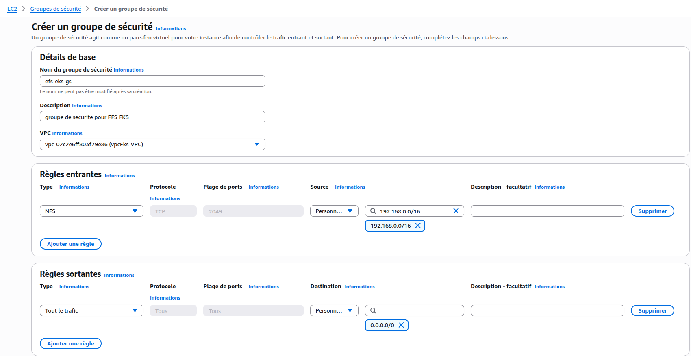
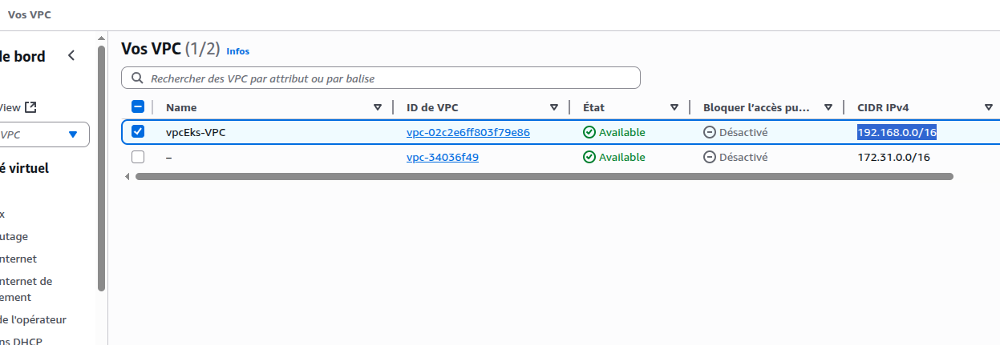
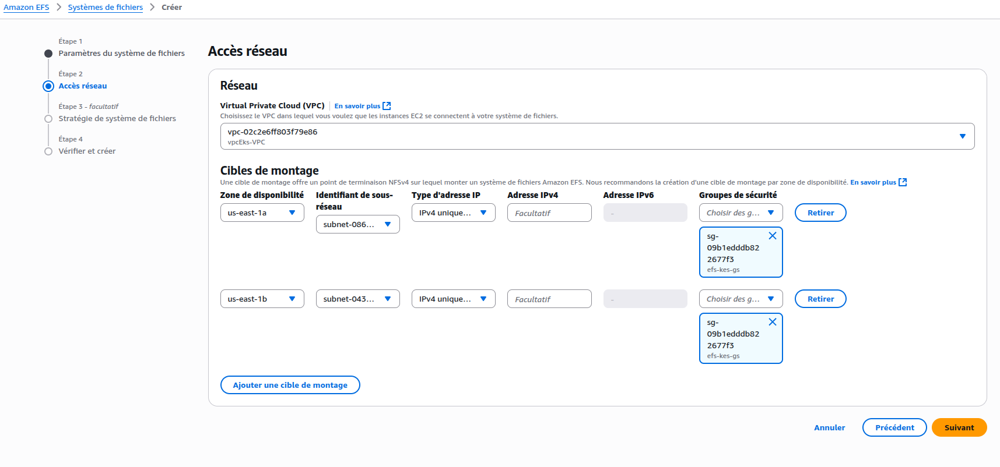
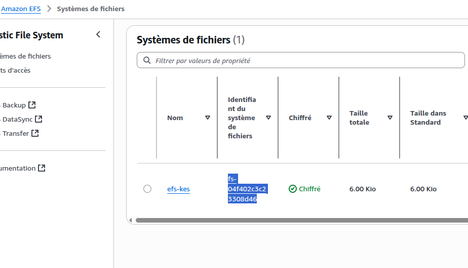
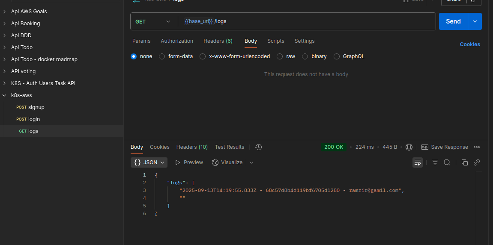

# Mise en place du stockage persistant avec Amazon EFS CSI sur EKS

Dans Kubernetes sur AWS EKS, tu as besoin de stocker les données de tes pods. Par défaut, les pods sont **éphémères** : si le pod est supprimé ou redéployé, ses données disparaissent.  
👉 C’est là qu’intervient le stockage persistant via **CSI (Container Storage Interface)** et **EFS (Elastic File System)**.
## Introduction:

### 1. CSI (Container Storage Interface)
- **CSI** est une **spécification standard** qui permet à Kubernetes d’utiliser différents types de stockage (EBS, EFS, FSx, etc.) via des plugins appelés **CSI drivers**.
- Sur AWS EKS, tu peux installer des **drivers CSI officiels** (comme le *Amazon EFS CSI driver*) pour connecter tes pods à des volumes persistants.

### 2. Amazon EFS (Elastic File System)
- **EFS** est un **système de fichiers partagé et managé par AWS**, basé sur NFS.
- Ses avantages sont:
    - **Persistant** → les données survivent même si les pods ou le cluster redémarrent.
    - **Partagé** → plusieurs pods/nœuds peuvent accéder au même volume en lecture/écriture.
    - **Élastique** → pas besoin de définir une taille fixe, il grandit automatiquement selon l’usage.

### 3. EKS + EFS CSI
- Quand tu installes le **EFS CSI driver** dans ton cluster EKS, Kubernetes peut alors créer des **PersistentVolumes (PV)** et **PersistentVolumeClaims (PVC)** liés à un système de fichiers Amazon EFS.
- Tes pods peuvent monter ce volume EFS comme un répertoire normal (par ex. `/mnt/data`).
- Cela permet notamment d’avoir un stockage partagé entre plusieurs microservices, ou de conserver les fichiers même si les pods sont recréés.

## Configurer le stockage Amazon EFS avec le pilote CSI sur EKS (`my-cluster`)

Pour ajouter du stockage partagé EFS à ton cluster EKS, il faut installer le module complémentaire **Amazon EFS CSI Driver** (`aws-efs-csi-driver`) dans la section modules complémentaires du cluster.


### Créer un groupe de sécurité pour EFS
- Donne un nom à ton groupe de sécurité, par exemple: `efs-eks-gs`.
- Sélectionne le VPC que tu as créé précédemment via CloudFormation (le même VPC utilisé par ton cluster EKS)
- Pour permettre la communication entre ton cluster EKS et EFS, ajoute une règle entrante NFS (TCP/2049):
  - Source: IP (Sélectionne le même VPC utilisé par ton cluster EKS.)
  - Port: 2049 (NFS)
  - Protocole: TCP




### crée un système de fichiers EFS
- Choisis un nom pour le système de fichiers EFS.
- Sélectionne le même VPC utilisé par ton cluster EKS.
- Pour chaque zone de disponibilité du VPC, crée un point de montage et associe le groupe de sécurité `efs-eks-gs`.



### Lancer le déploiement

Avant de lancer le déploiement, il est nécessaire de mettre à jour l'**identifiant du système de fichiers EFS** dans la configuration du PersistentVolume (PV):



```yaml
...
  csi:
    driver: efs.csi.aws.com
    # <AJOUTER l'ID de votre EFS !>
    volumeHandle: fs-04f402c3c23308d46
...
```
> Remplace toujours `fs-04f402c3c23308d46` par l’ID réel de ton système EFS dans AWS.

Ensuite, tu peux déployer les ressources Kubernetes
```
$ kubectl apply -f users.yaml -f auth.yaml
```

