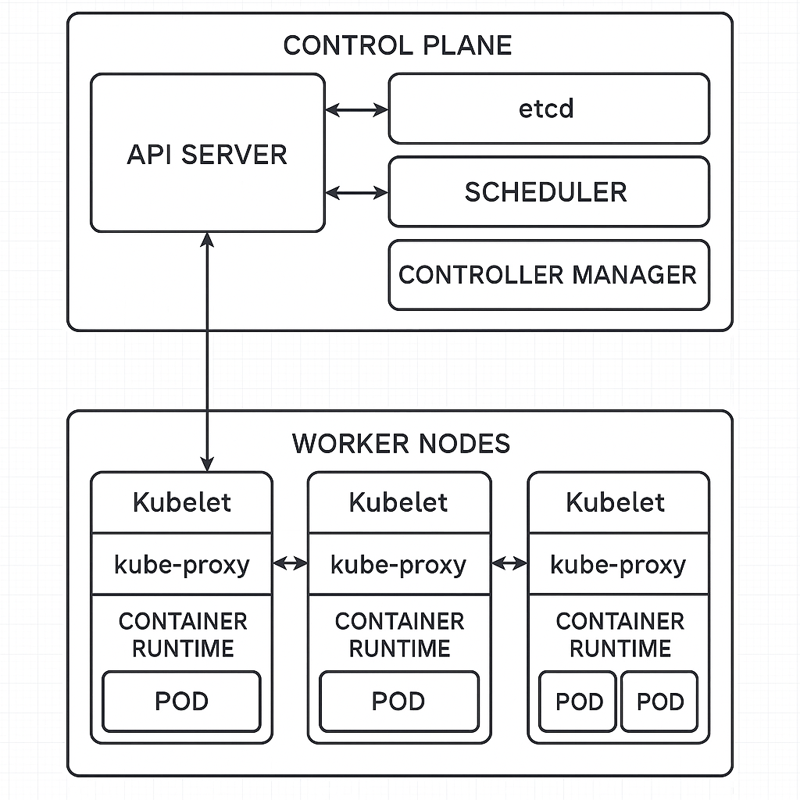

## Kubernetes

### 🧠 MASTER NODE (Plan de contrôle)

1. **API Server**

    * C’est **la porte d’entrée** de Kubernetes.
    * Tout passe par lui : `kubectl`, Dashboard, autres composants.
    * Il reçoit les ordres (ex : créer un Pod), et les transmet aux autres composants.

2. **Scheduler**

    * Il choisit **sur quel Worker Node** déployer un nouveau Pod.
    * Il regarde les ressources dispo, etc.

3. **Controller Manager**

    * Il **surveille et ajuste** l’état du cluster (par exemple : recréer un Pod qui a planté).

4. **etcd**

    * C’est **la base de données** de Kubernetes.
    * Il garde la configuration et l’état du cluster.

---

### 🛠 WORKER NODE

1. **kubelet**

    * Reçoit les instructions de l’API Server.
    * **Gère les Pods sur ce nœud** (créer, démarrer, surveiller…).

2. **kube-proxy**

    * Gère **le réseau** : il connecte les Pods entre eux, aux Services, etc.

3. **Pods**

    * Unité de base de Kubernetes. Chaque Pod contient **un ou plusieurs conteneurs**.
    * Kubernetes déploie des Pods, pas des conteneurs directement.

4. **Containers**

    * Ton application, empaquetée dans un conteneur (souvent Docker).

5. **Volumes (optionnel)**

    * Espace de stockage partagé pour les conteneurs d’un Pod.

---

### 🔗 OUTILS EXTERNES

* **kubectl** : Ligne de commande pour interagir avec l’API Server.
* **Kubernetes Dashboard** : Interface graphique.
* **minikube** : Kubernetes local (pour apprentissage ou test).
* **EKS (AWS)** : Service Kubernetes géré sur AWS.
* **Kubermatic** : Plateforme pour déployer Kubernetes (multi-cloud).



---
## Introduction:
Kubernetes est un système open source qui permet d’automatiser le déploiement, la gestion et la mise à l’échelle d’applications conteneurisées sur un groupe de serveurs appelé « cluster ».\
Kubernetes utilise plusieurs **« objets »** de base pour organiser et exécuter les applications :

- **Les Pods** : l’unité la plus petite, contenant un ou plusieurs conteneurs qui partagent le même réseau et stockage. Les conteneurs d’un même Pod peuvent donc communiquer entre eux via localhost.
- **Les Deployments** : objets de contrôle qui gèrent la création et la gestion automatique de Pods. Par exemple, si un Pod échoue ou disparaît, le Deployment créera automatiquement un nouveau Pod pour maintenir le nombre souhaité.
- **Les Services** : objets qui rendent accessibles les Pods par le réseau, à l’intérieur ou à l’extérieur du cluster. Un Service attribue une IP fixe et peut répartir la charge entre plusieurs Pods.
- **Les Volumes** : permettent de gérer le stockage persistant partagé entre les conteneurs d’un Pod ou entre plusieurs Pods.

Pour créer ou modifier les **objets Kubernetes**, on utilise deux approches :

- **Déclarative** : on décrit l’état voulu du cluster dans des fichiers (généralement en YAML), puis Kubernetes se charge d’atteindre et de maintenir cet état.
- **Impérative** : on donne directement des commandes à Kubernetes (exemple : kubectl run, kubectl delete) pour créer, modifier ou supprimer des objets instantanément.

**Il est important de comprendre que :**

- Les **Pods sont éphémères** : Kubernetes peut les supprimer ou les remplacer à tout moment (après un redémarrage, une panne ou une mise à jour).
- D’habitude, un Pod reçoit une adresse IP interne au cluster. Pour exposer une application vers l’extérieur, on utilise un Service.
- Plutôt que de gérer **~~les Pods manuellement~~**, on utilise **les objets de contrôle** (comme Deployment, StatefulSet, ReplicaSet…) qui se chargent d’en **créer**, de les **remplacer** ou de les **supprimer** selon les besoins du cluster et les consignes de l’utilisateur.

## Installation
L’installation d’un environnement Kubernetes local nécessite deux outils principaux : **kubectl** et **Minikube**.

### 1. Installer kubectl
kubectl est l’outil en ligne de commande permettant d’administrer Kubernetes.
https://kubernetes.io/docs/tasks/tools/install-kubectl-linux/

### 2. Installer Minikube
Minikube permet de lancer un cluster Kubernetes local, idéal pour le développement et les tests: https://minikube.sigs.k8s.io/docs/start/

### 3. Démarrer Minikube avec Docker comme driver

Assure-toi d’avoir Docker installé et fonctionnel sur ta machine.

```
$ minikube start --driver=docker
$ minikube status
```

- `minikube start --driver=docker` : démarre un cluster Kubernetes local en utilisant Docker.
- `minikube status` : affiche le statut du cluster local.

Grâce à ce setup, tu peux expérimenter Kubernetes en local.

## Deployments
Un Deployment est un objet clé dans Kubernetes, car on ne crée généralement pas les Pods manuellement ni ne les place soi-même sur les worker nodes.\
À la place, on définit un objet Deployment où l’on indique combien de Pods on souhaite, avec quels conteneurs (images), et Kubernetes se charge de créer automatiquement ces Pods et de les répartir sur les nœuds disponibles du cluster, en tenant compte des ressources (CPU, mémoire) nécessaires et disponibles sur chaque nœud.\ 
Cela garantit que les Pods sont toujours lancés là où il y a assez d’espace et de mémoire.

Un autre avantage important du Deployment est la gestion simplifiée des mises à jour et des retours-arrière (rollback):\
Par exemple, si une nouvelle version de ton application pose problème, tu peux très facilement annuler le déploiement et revenir à la version précédente du Deployment, ce qui rétablit automatiquement l’ancien état du cluster.

Kubernetes permet aussi d’activer l’autoscaling des Pods via le Horizontal Pod Autoscaler:\
Cette fonction surveille automatiquement certaines métriques (comme l’utilisation du CPU ou de la mémoire) et peut décider d’ajouter (ou retirer) des Pods pour s’adapter à la charge, sans intervention manuelle.

Attention à une nuance importante : un Deployment sert à gérer un groupe de Pods identiques (par exemple, pour la même application).\
Si tu as besoin que Kubernetes gère plusieurs types d’applications (différents Pods), tu dois créer plusieurs objets Deployment, chacun associé à sa propre définition de Pods.

