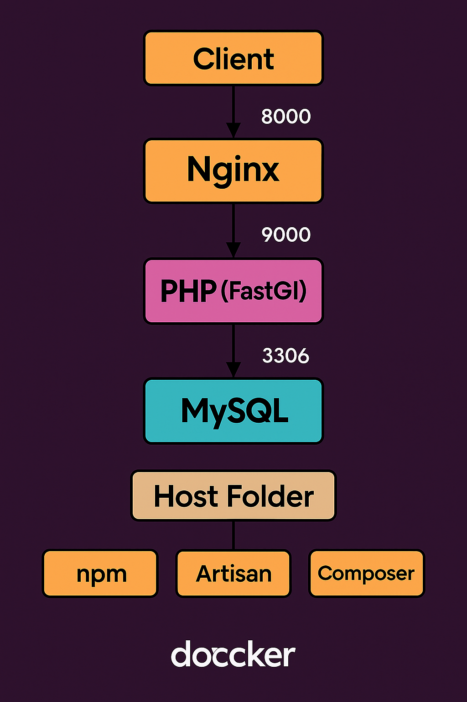

Dans le projet, le fichier `docker-compose.yml` comprend 6 services, répartis ainsi :

### 1. Services principaux (lancement applicatif)

- **nginx** : Serveur web qui réceptionne les requêtes HTTP.
- **php** : Interprète PHP-FPM exécutant le code Laravel.
- **mysql** : Conteneur de base de données MySQL.


### 2. Services utilitaires

- **composer-utility** : Sert à exécuter les commandes Composer, en particulier la création ou gestion du projet Laravel.
- **artisan-utility** : Sert à lancer les commandes Artisan (CLI Laravel), par exemple pour les migrations, les seeders, etc.
- **npm-utility** : Destiné à lancer les commandes NPM (installation et build des assets front, compilation, etc.).


### Installation de Laravel dans le dossier `src` (via composer-utility)

Pour installer Laravel dans le dossier `src` grâce au service `composer-utility` :

```
$ mkdir src
$ docker compose run --rm composer-utility create-project laravel/laravel .
```

> **Attention** : Assurez-vous que le dossier `src` (mappé en volume) est vide avant d’exécuter cette commande.

### Modification des variables d'environnement dans `.env`

Après la création du projet Laravel dans le dossier `src`, ouvrez le fichier `src/.env` et adaptez les variables pour que la connexion à la base de données corresponde à celles déclarées dans `env/mysql.env`. Par exemple :

```env
DB_CONNECTION=mysql
DB_HOST=mysql
DB_PORT=3306
DB_DATABASE=homestead
DB_USERNAME=homestead
DB_PASSWORD=secret

# Alternative recommandée si vous ne souhaitez pas gérer la table "sessions" en base
SESSION_DRIVER=cookie
```

> **Note :**
> Dans Docker Compose, il faut mettre dans `DB_HOST` **le nom du service** déclaré dans le `docker-compose.yml` (ici, `mysql`) et non pas la valeur du paramètre `container_name`.

### Lancer uniquement les services applicatifs

Pour démarrer l’environnement applicatif (sans les utilitaires), utilisez :

```
$ docker compose up --build -d nginx php mysql
```

- Cette commande initialise et démarre exclusivement les services nécessaires au fonctionnement de l’application.

## Architecture Générale

L'architecture de ce projet suit une approche de microservices utilisant Docker Compose pour orchestrer plusieurs conteneurs spécialisés. 
Cette approche permet une séparation claire des responsabilités et une scalabilité optimale pour le développement d'applications Laravel.

### Structure du Projet

```
project/
├── docker-compose.yml
├── dockerfiles/
│   ├── php.dockerfile
│   └── composer.dockerfile
├── src/
│   └── [code Laravel]
├── nginx/
│   └── nginx.conf
└── env/
    └── mysql.env
```

Cette structure suit les meilleures pratiques Docker en séparant les préoccupations et en maintenant une configuration claire et maintenable.

## Services Principaux

### Service Nginx (Serveur Web)

Le service Nginx agit comme serveur web et reverse proxy, gérant les requêtes HTTP entrantes et les transmettant au service PHP via FastCGI \
**Rôle technique:** Nginx sert les fichiers statiques et transmet les requêtes PHP au service PHP-FPM via le protocole FastCGI sur le port 9000.
Cette séparation permet une meilleure performance et scalabilité.

### Service PHP (Traitement PHP-FPM)

Le service PHP utilise PHP-FPM (FastCGI Process Manager) pour traiter les requêtes PHP de manière efficace.

### Service MySQL (Base de Données)

Le service MySQL fournit la persistance des données pour l'application Laravel.

## Services Utilitaires

### Composer Utility

Service utilitaire pour gérer les dépendances PHP avec Composer sans installation locale.

**Usage typique:**

```
$ docker compose run --rm composer-utility install
$ docker compose run --rm composer-utility require package/name
```


### Artisan Utility

Service utilitaire pour exécuter les commandes Laravel Artisan dans l'environnement containerisé.

**Usage typique:**

```
$ docker compose run --rm artisan-utility migrate
$ docker compose run --rm artisan-utility make:controller UserController
```

Cette approche évite d'installer PHP localement tout en conservant l'accès complet aux commandes Artisan.

### NPM Utility

Service utilitaire pour la gestion des assets frontend avec Node.js et NPM.

**Usage typique:**

```
$ docker compose run --rm npm-utility install
$ docker compose run --rm npm-utility run dev
$ docker compose run --rm npm-utility run build
```


## Guide de Lancement

### Commandes de Base

**1. Construction et lancement de tous les services:**

```
$ docker compose up -d --build
```

**2. Lancement des services existants:**

```
$ docker compose up -d
```

**3. Arrêt des services:**

```
$ docker compose down
```

**4. Visualisation des logs:**

```
$ docker compose logs -f [service-name]
```

**5. Accès aux containers:**

```
$ docker compose exec php sh
$ docker compose exec nginx sh
```


### Workflow de Développement

**1. Installation initiale des dépendances:**

```
# Installation des dépendances PHP
$ docker compose run --rm composer-utility install

# Installation des dépendances Node.js
$ docker compose run --rm npm-utility install

# Génération de la clé d'application Laravel
$ docker compose run --rm artisan-utility key:generate
```

**2. Migration et seeding de la base de données:**

```
# Exécution des migrations
$ docker compose run --rm artisan-utility migrate

# Seeding des données
$ docker compose run --rm artisan-utility db:seed
```

**3. Compilation des assets:**

```
# Développement
$ docker compose run --rm npm-utility run dev

# Production
$ docker compose run --rm npm-utility run build
```


