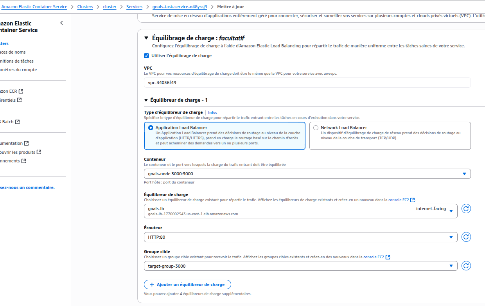

```
$ docker build -t rhannachi1991/gols-node ./backend/
```

```
$ docker login
$ docker push rhannachi1991/gols-node:latest
```

### La création d'un cluster ECS AWS:
#### Configuration générale de la tâche
- **Nom de la famille de tâche :** Exemple : `goals-task`.
- **Type de lancement :** Sélectionnez **AWS Fargate** pour un déploiement serverless.
- **Rôles IAM :** Sélectionnez les rôles d’exécution adéquats (`ecsTaskExecutionRole`).

### Container 1
#### 1. Définir le conteneur principal
- **Nom du conteneur :** Par exemple, `goals-node`.
- **URI de l’image :** Spécifiez l’image Docker (ex : `rhamnachi1991/goals-node:latest`).
- **Conteneur essentiel :** Cochez "Oui" si c’est le conteneur principal.

#### 2. Mappage des ports
- **Port du conteneur :** Indiquez le port interne utilisé (ex : 80).
- **Protocole :** Généralement `TCP`.
- **Protocole de l’application :** Spécifiez le protocole applicatif, ici `HTTP`.

#### 3. Variables d’environnement
- Ajoutez les variables nécessaires comme :
    - `MONGODB_USERNAME`
    - `MONGODB_PASSWORD`
    - `MONGODB_URL`

#### 4. Configuration Docker (facultative)
- **Commande de lancement :** Par exemple, `node,app.js` pour démarrer l’application Node.js.

#### 5. Ordre des dépendances de démarrage :
- La condition de lancement choisie est Healthy. Cela signifie que le conteneur `goals-node` ne démarrera qu’une fois que le conteneur mongodb sera en état "sain". Cela garantit que l’application ne démarre qu’une fois la base MongoDB opérationnelle.

### Container 2
#### 1. Définir le conteneur principal
- **Nom du conteneur :** `mongodb`.
- **URI de l’image :** Spécifiez l’image Docker (`mongo`).
- **Conteneur essentiel :** Cochez "Oui" si c’est le conteneur principal.

#### 2. Mappage des ports
- **Port du conteneur :** Indiquez le port interne utilisé (27017).
- **Protocole :** Généralement `TCP`.

#### 3. Variables d’environnement
- Ajoutez les variables nécessaires comme :
    - `MONGO_INITDB_ROOT_USERNAME`
    - `MONGO_INITDB_ROOT_PASSWORD`
#### 4. Healthcheck
- dans le conteneur mongodb: `CMD-SHELL,mongosh --eval 'db.runCommand("ping").ok' --quiet` : Cette commande utilise le client mongosh pour exécuter la commande MongoDB ping. Elle vérifie que la base répond et fonctionne
- dans le conteneur nodejs: `CMD-SHELL,curl --fail http://127.0.0.1:3000/healthcheck || exit 1`


### Ajouter un groupe de sécurité :
créer un groupe de sécurité `port-80-open-anywhere` avec les règles nécessaires pour autoriser le trafic entrant et sortant sur les ports requis `80`. 
Cela permettra d'accéder à notre cluster ECS depuis l'extérieur du réseau AWS.


### La création d'un service :

#### 1. Sélectionner la bonne définition de tâche
- Dans la section **Famille de définition de tâche**, choisis la définition de tâche que tu viens de créer (`goals-task`).
- Sélectionne la dernière révision de la définition de tâche (ex: Révision 1).
- Donne un **nom unique au service** (ex. : `goals-task-service-o48yssj9`).

#### 2. Environnement et options de calcul
- **Type de fournisseur de capacité** : Choisis `FARGATE`, qui est la meilleure option serverless pour lancer des tasks sans gérer d’EC2.
- Vérifie la version de plateforme (recommande : `LATEST`).
- Type de stratégie de planification : `Replica` (défini le nombre de tâches souhaitées à maintenir, ici : 1).

#### 3. Réglages réseau (Point critique souvent oublié)

- **VPC** : Vérifie que tu utilises le bon VPC (ici `vpc-34036f49`).
- **Sous-réseaux** : Sélectionne ceux qui couvrent tes zones de disponibilité pour assurer la haute disponibilité.
- **Groupes de sécurité** :
    - NE PAS utiliser seulement le groupe de sécurité par défaut.
    - **IL EST ESSENTIEL** d’ajouter explicitement le groupe de sécurité `port-80-open-anywhere` pour permettre l’accès HTTP sur le port 80 à tes tâches.
- **Adresse IP publique** : Active cette option si tu veux que la tâche soit accessible publiquement.


---

### Load Balancer

Une étape non essentielle, mais intéressante, consiste à faire tourner notre conteneur Node.js sur le port 3000, et non plus sur le port 80.
Dans ce cas, **il devient nécessaire d'utiliser un load balancer** si l'on souhaite que le port 80 d'une adresse publique soit redirigé vers le port 3000 du conteneur Node.js en architecture Fargate. 
En effet, Fargate ne permet pas de faire un simple port mapping direct comme sur EC2 : il faut passer par un load balancer pour exposer le service sur le port 80.

#### Modifier le port d’écoute du projet Node.js sur 3000

1. **Dans `app.js`**
   Modifie ou assure-toi que l’application écoute sur le port 3000 :
```js
app.listen(3000);
```
2. **Dans le `Dockerfile`**
   Expose le port 3000 afin que Docker sache quel port doit être accessible à l’extérieur du conteneur :
```dockerfile
EXPOSE 3000
```

3. **Dans `docker-compose.yml`**
   Voici comment mapper le port 3000 du conteneur sur le port 80 de l’hôte :
```yaml
backend:
  build: ./backend
  ports:
    - "80:3000"
```

```
$ docker build -t rhannachi1991/gols-node ./backend/
```

```
$ docker login
$ docker push rhannachi1991/gols-node:latest
```

#### Création d'un Target Group :
Lors de la création du groupe cible :
- **Nom du groupe cible** : `target-group-3000`
- Sélectionner « Adresse IP » comme type de cible.
- Laisser le champ « Saisissez une adresse IPv4 depuis un sous-réseau VPC » vide (pour permettre à ECS de gérer automatiquement l’enregistrement des IP des tâches).
- Saisir le port 3000.
- Définir le chemin d’état sur `/healthcheck` (qui doit exister dans ton application Node.js).

Ensuite, lors de la configuration du listener du Load Balancer :

- Ajouter une règle pour que le trafic reçu sur le port 80 soit redirigé vers ton `target-group-3000` — ce qui assurera que les requêtes reçues sur le port 80 public sont transmises à ton conteneur sur le port 3000 en Fargate.


#### Création d'un Load balancer :
- 1. Lors de la création d’un **Application Load Balancer** (ALB) :
  - Choisis un nom, par exemple : `goals-lb`.
  - Pour la portée, sélectionne : **Accessible sur Internet** (Internet-facing).
  - Utilise le même VPC que celui employé lors de la création du service dans le cluster ECS.
  - Sélectionne au minimum **deux zones de disponibilité** différentes pour assurer la haute disponibilité.
- 2. **Groupes de sécurité** :
  - Ajoute, en plus du groupe de sécurité du VPC, un groupe de sécurité supplémentaire nommé `port-80-open-anywhere`, qui autorise le trafic entrant sur le port 80 depuis l’extérieur.
  - Ainsi, le Load Balancer sera joignable publiquement sur le port 80.
- 3. **Écouteurs et routage** :
  - Pour l’écouteur du port 80 (HTTP), dans la section « Action par défaut », sélectionne le **target group** que tu as créé auparavant : `target-group-3000`.


#### Mettre à jour notre service dans le cluster ECS

- 1. Dans le cluster ECS, sélectionne le service **`goals-task-service`** puis clique sur **"Mettre à jour"**.
- 2. Dans la section **Équilibrage de charge** (Load Balancing) :
  - Choisis le type d’équilibreur de charge : **Application Load Balancer**.
  - Sélectionne le conteneur **`goals-node`** qui écoute sur le port **3000**.
  - Sélectionne l’équilibreur de charge **`goals-lb`** que tu viens de créer.
  - Pour l’écouteur, sélectionne **HTTP:80** afin d’indiquer que le Load Balancer écoute sur le port 80.
  - Pour le groupe de cibles, sélectionne **`target-group-3000`** pour rediriger le trafic vers le port 3000 du conteneur `goals-node`.



